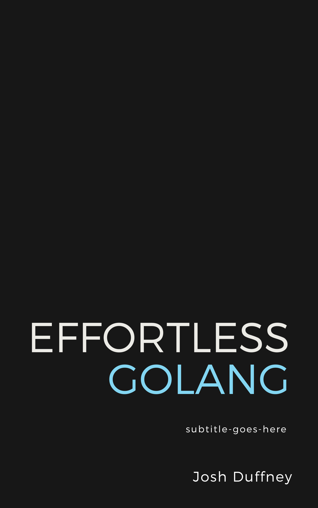

# Effortless Golang

I considered writing a book about Go, but decided not to. Instead I've compiled a list of curated resources to make learning the language as effortless as possible. Hince the name "Effortless Go".

You can **Follow** me on Twitter [@joshduffney](https://twitter.com/joshduffney).

If I were to start over, I'd read these books in this order:

Learn the Language Fundamentals
- [Introducing Go](https://www.oreilly.com/library/view/introducing-go/9781491941997/) by Caleb Doxsey
- [Go in Action](https://www.manning.com/books/go-in-action-second-edition) by William Kennedy, Brian Ketelsen, and Erik St.Martin
- [Learning Go](https://www.oreilly.com/library/view/learning-go/9781492077206/) by Jon Bodner

Web Development
- [Building Go Web Services and Applications](https://app.pluralsight.com/library/courses/go-building-web-services-applications) by me
- [Let's Go](https://lets-go.alexedwards.net/) by Alex Edwards
- [Let's Go Further](https://lets-go-further.alexedwards.net/) by Alex Edwards 

Building CLIs
- [Master Go CLI and TUI](https://leanpub.com/go-cli-tui) By Ravikanth Chaganti
- [Building Modern CLI Applications in Go](https://www.packtpub.com/product/building-modern-cli-applications-in-go) by Marian Montagnino

---

## Table of Contents

> This is the outline from the book proposal I never sent. But if I had to start over learning Go, this is how I'd go about it.

1.	Before you begin
    1.1.	Who should read this book.
    1.2.	Go as your first programming language.
    1.3.	[The Go Playground](https://play.golang.com/)
2.	Built-in types
    2.1.	[Data structures](https://www.geeksforgeeks.org/data-structures/)
    2.2.	[Staticaly typed vs dynamic](https://stackoverflow.com/questions/1517582/what-is-the-difference-between-statically-typed-and-dynamically-typed-languages)
    2.3.	[Primitive types](https://medium.com/golang-jedi-knight/primitive-data-types-in-golang-35a291df3bbe)
        2.3.1.	Numbers
        2.3.2.	Booleans
        2.3.3.	Bytes and Runes
    2.4.	Composite types
        2.4.1.	Arrays
        2.4.2.	Slices
        2.4.3.	Strings
        2.4.4.	Maps
    2.5.	Using fmt to determine the type.
    2.6.	The Zero Value
3.	Variables, Constants, and Declarations
    3.1.	Naming variables
    3.2.	Defining muliple variables
    3.3.	Using the short variable delcaration :=
    3.4.	Variable scopes
        3.4.1.	blocks
    3.5.	Constants
        3.5.1.	const vs var
    3.6.	Type and untyped declarations
        3.6.1.	Explicit type conversion
4.	Control Structures
    4.1.	What is a control structure?
    4.2.	The if Statement.
        4.2.1.	Avoid else at all costs.
    4.3.	The switch statements.
    4.4.	The for Statement
        4.4.1.	Range
5.	Functions
    5.1.	Declaring and calling functions
        5.1.1.	Named and optional parameters
    5.2.	Variadic input parameters
    5.3.	Return values.
    5.4.	Ignoring returned values
    5.5.	Anonymous functions
    5.6.	Closures
6.	Pointers
    6.1.	What are pointers?
    6.2.	Understanding memory addresses and values
    6.3.	Why are pointers important?
    6.4.	Declaring, referencing, and dereferencing pointers.
    6.5.	Avoiding nil pointers and null pointer dereferences. 
7.	Go’s Type System
    7.1.	Structs
        7.1.1.	User defined types
        7.1.2.	Type embedding
        7.1.3.	Anonymous structs
        7.1.4.	Struct literals
    7.2.	Methods
        7.2.1.	Receivers
        7.2.2.	Method sets.
    7.3.	Interfaces
        7.3.1.	Polymorphism
8.	Leaving the playground
    8.1.	Installing Go
    8.2.	Go developer survey data results for Go dev environments.
    8.3.	VS code setup
    8.4.	Neovim setup
    8.5.	Using the Go tools
        8.5.1.	Go run
        8.5.2.	Go build
9.	Packages, modules, and repositories
    9.1.	Creating a package
        9.1.1.	Go mod
    9.2.	Flat structure
    9.3.	Within a directory
    9.4.	Withing a pkg folder
    9.5.	Imports and Exports
        9.5.1.	Capitals for exports
        9.5.2.	Local imports
    9.6.	3rd party imports
    9.7.	Is that’s a package, what’s a module?
    9.8.	Library \ dependency management
    9.9.	Comment-based documentation
10.	The Standard Library
    10.1	Navigating pkg.go.dev
    10.2	Core packages
        10.2.1	Reading data from files (io/ioutil,)
        10.2.2	Create an http server.
        10.2.3	Sorting with algorithms
11.	Create a RESTful web service
    11.1.	Setting up the project structure
    11.2.	Understanding the net/http package
    11.3.	Creating a healthcheck endpoint
    11.4.	Making a user-defined application type with methods
    11.5.	Adding routes and handlers
12.	Build a command line app
    12.1.	Adding a cmd app to the project repo
    12.2.	Understanding the flags package
    12.3.	Designing use cases
    12.4.	The anatomy of a commandline app
    12.5.	Implementing commands
    12.6.	Adding flags
    12.7.	Interacting with APIs
13.	Writing Tests in Go
    13.1.	Identifying test cases
    13.2.	The test package.
    13.3.	What are the different types of tests?
    13.4.	Writing unit tests to validate code.
    13.5.	Testing your API
    13.6.	Testing your CLI app
